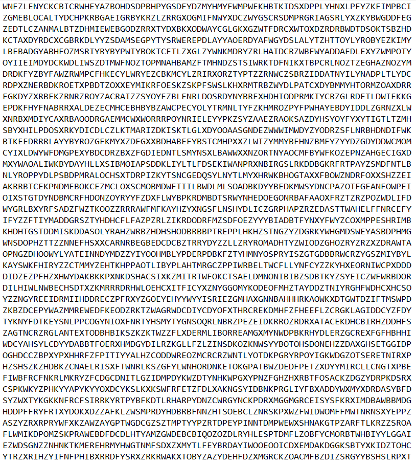

# Advanced-Word-Puzzle-solver
=> An efficient algorithm to solve word puzzle, in addition to the option to have the ability to convert a word puzzle image into text puzzle and run the solver to solve the converted puzzle. 
## In this project we have two main parts, the first part will be the image-conversion script, and the second part will be for the solver algorithm. 
### Part 1 : Convert image to text 
In previous step we used a custom dataset created from a set of images to train OCR models espically for our specific word case, and due to the diffuluty of the input raw image can be, we came up with idea of using multiple models to generate our final input and do some analysis for each output extracted from each model then combine the results to get the final prediction, so basicly our input would be something like this :

and it needs to be converted into a raw_text like this : 

